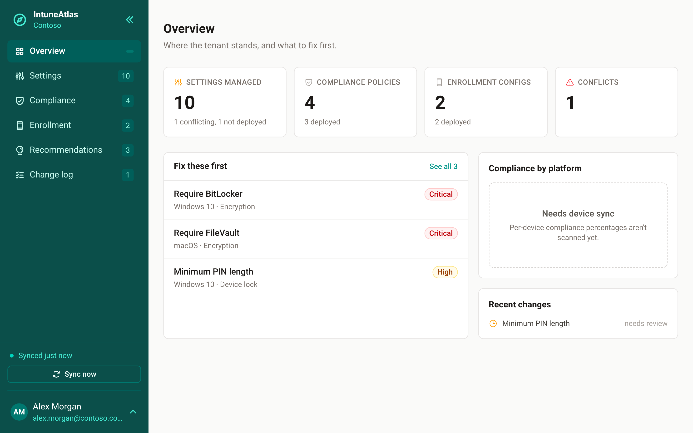
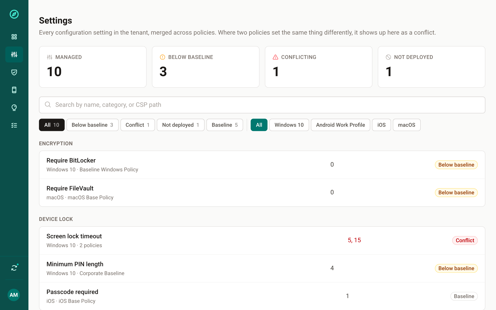

# IntuneAtlas

**[intuneatlas.com](https://intuneatlas.com)**

Flatten every Intune profile into one settings index, keyed on the CSP path.

The Intune portal is organised around policies. Devices apply a merged set of
settings. IntuneAtlas is meant to read a tenant read-only, rebuild that merge,
and serve it as something you can actually search: grouped by category, keyed
by CSP path, with conflicts, coverage gaps, and baseline drift surfaced
instead of buried in per-policy views.

<p>
  
  
</p>

**Status: early, but real.** Baselines and a review-gated change log are
real; write-back to the tenant and platform coverage beyond Windows aren't —
see the roadmap below. Backed by a real test suite, not just typechecking —
see [`test/`](./test).

## Getting started

```
irm https://intuneatlas.com/install.ps1 | iex          # Windows
curl -fsSL https://intuneatlas.com/install.sh | bash    # Linux
```
```
intuneatlas ui --tenant <your-tenant>.onmicrosoft.com
```

That's it for a solo run. The **[Getting started guide](https://intuneatlas.com/docs/)**
covers the one-time Entra app registration the first sign-in needs, sharing
it with a team and assigning roles, and has the full
[CLI reference](https://intuneatlas.com/docs/cli.html). Building from a
clone instead: `npm install && npm run build && node dist/cli.js ui`.

## What's in this repo

| Path | What it is |
|---|---|
| [`index.html`](./index.html) | Static marketing/landing page for the project |
| [`src/`](./src) | The CLI — auth, Graph scanning, settings index, local server |
| [`web/`](./web) | The local web UI (Vite + React), served by `intuneatlas ui` |
| [`test/`](./test) | Fixture-driven regression tests for the merge/conflict/baseline logic and the auth/authorization layer |
| [`_headers`](./_headers) | Cloudflare Pages response headers (CSP, etc.) for the landing page |

## The idea

- **Conflicts** — two profiles set the same CSP path to different values with
  overlapping assignment.
- **Below baseline** — a setting is weaker than whichever benchmark you point
  it at (Microsoft security baselines, CIS, or your own house rules as YAML).
- **Not deployed** — a profile looks healthy in the portal but targets no
  group, so it silently affects nothing.
- **Documented** — a note explaining a deliberate deviation, attached to the
  setting itself so context survives the person who wrote it.

Baselines are meant to be plain YAML files in a directory, so contributing a
rule doesn't require touching any code.

## Trust model

This is a tool you point at your own Intune tenant, so it's worth being
explicit about what's actually verifiable, rather than asking for trust:

- **No shared trust surface.** There's no bundled client ID or shared
  service anywhere — every install registers its own Entra app and signs in
  with it. A compromise of this project's own infrastructure (there isn't
  much of it) can't compromise your tenant, because nothing of yours ever
  runs through anything shared.
- **Build provenance, not just a signature.** Every released binary carries
  a [Sigstore](https://www.sigstore.dev/)-signed attestation binding it to
  the exact commit, repository, and workflow it was built from — free, via
  GitHub's public-good instance, checkable yourself with
  `gh attestation verify <file> --repo jgeselle/intuneatlas`. This is a
  different, more specific claim than a code-signing certificate makes: a
  cert says "someone holding this key signed this file"; an attestation
  says "this exact binary came from this exact commit, built by this exact
  workflow, in this exact repo." For a tool whose source you can already
  read, that's the more relevant assurance — which is why this project
  ships attestations instead of paying for a certificate, not merely in
  place of one for lack of budget. (The Windows SmartScreen warning on
  first run is real either way — that's about publisher reputation, which
  only a paid certificate resolves — but it's a UX cost, not a security
  gap.) An SBOM attestation ships alongside, for anyone whose procurement
  process wants one. Both are wired into
  [`release.yml`](./.github/workflows/release.yml).
- **Read-only, and testably so.** IntuneAtlas never writes back to your
  tenant — see [`test/`](./test) for the regression suite covering the merge
  logic that decides what you see.
- **Access is enforced server-side, not just hidden in the UI.** Entra App
  Roles (Viewer / Contributor / Admin) gate every mutating action, in the
  web UI and the CLI alike — see the
  [Getting started guide](https://intuneatlas.com/docs/) for assigning them.

## Maintenance expectations

This is a solo, unpaid, MIT-licensed project — not a company, not a
product with an SLA. I maintain it because I use it, on a best-effort
basis; there's no guaranteed response time on issues or feature requests.
Found a security issue? Please see [`SECURITY.md`](./SECURITY.md) rather
than opening a public issue.

## Roadmap

- [x] Graph API read-only scan of Intune policies (Windows Settings Catalog, compliance, enrollment)
- [x] CSP path merge + conflict/coverage detection
- [x] `intuneatlas ui` — web UI over the generated index, solo or shared with a team (`--host`), everyone signing in with their own Microsoft account
- [x] Baseline rule engine (YAML) with a real starter pack
- [x] Review-gated change log (stage a recommendation, require a reason and a signed-in reviewer)
- [x] Packaging: standalone Windows binary (SEA), PowerShell installer, winget manifest template
- [x] `ui --persist` / `--stop` — a shared instance that survives reboots (Scheduled Task on Windows, systemd on Linux)
- [x] Entra App Roles (Viewer / Contributor / Admin), enforced server-side across the UI and CLI
- [x] Sigstore build provenance + SBOM attestations on every released binary — see [Trust model](#trust-model)
- [ ] Actually deploying a staged change back to the tenant (write-back) — deliberately deferred; the review gate above exists, the write doesn't yet
- [ ] `intuneatlas get <path>` headless command
- [ ] Azure-hosted deployment (Bicep, scheduled scans) — the auth this needs is now built, the infra-as-code isn't
- [ ] GitHub Action for scheduled drift scanning

## License

[MIT](./LICENSE) © 2026 IntuneAtlas contributors

Not affiliated with, endorsed by, or supported by Microsoft. Intune and
Microsoft Graph are Microsoft trademarks.
