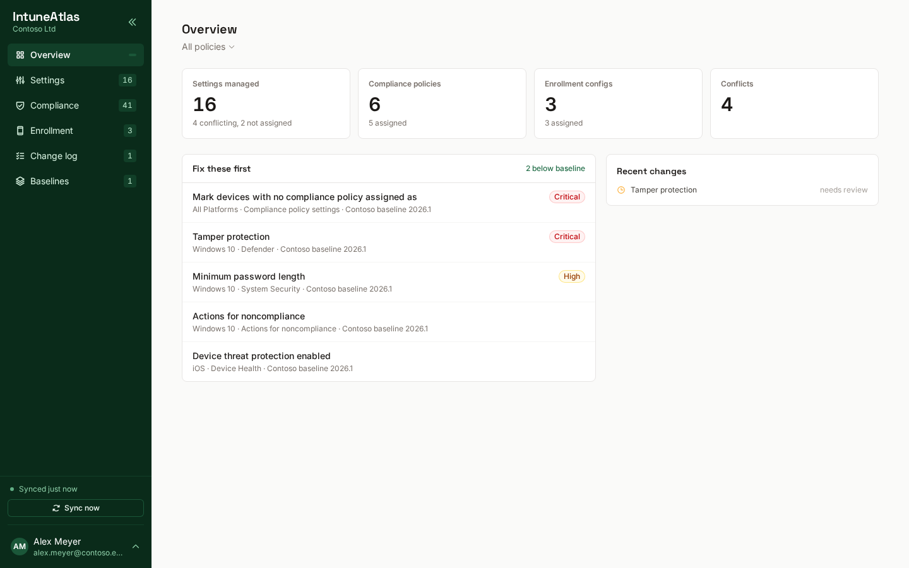
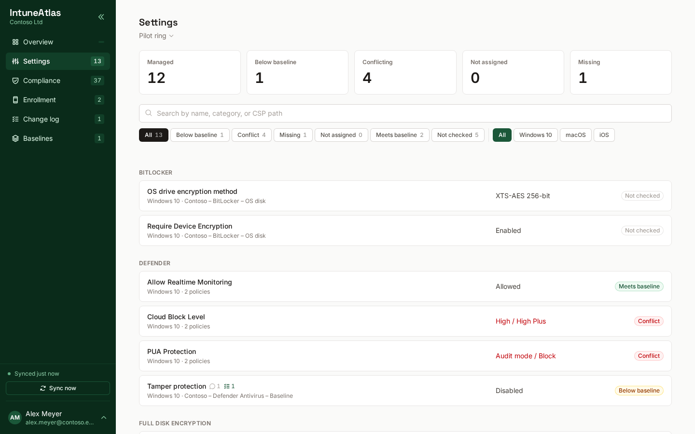
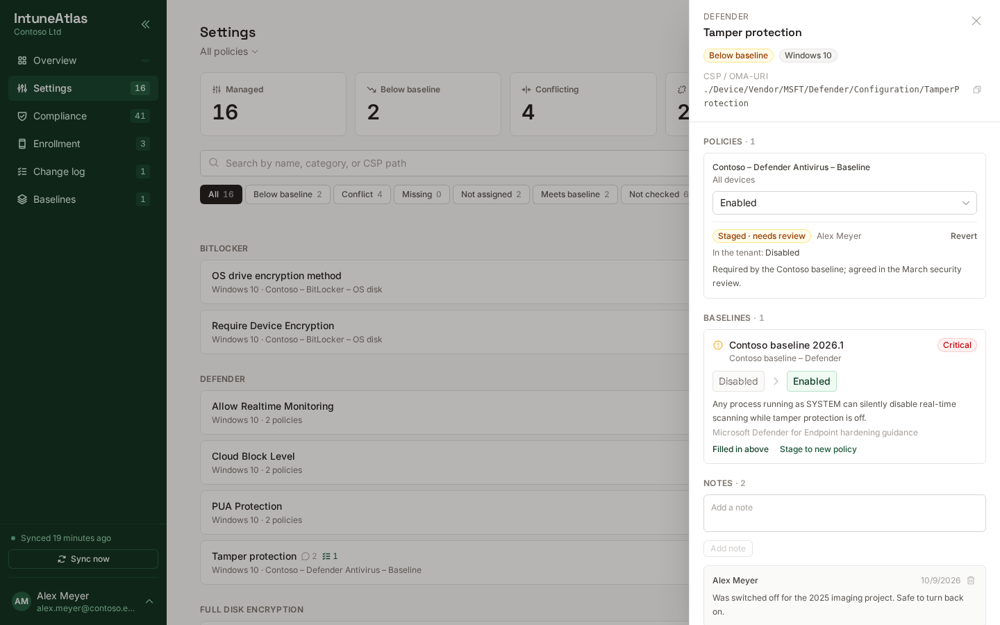
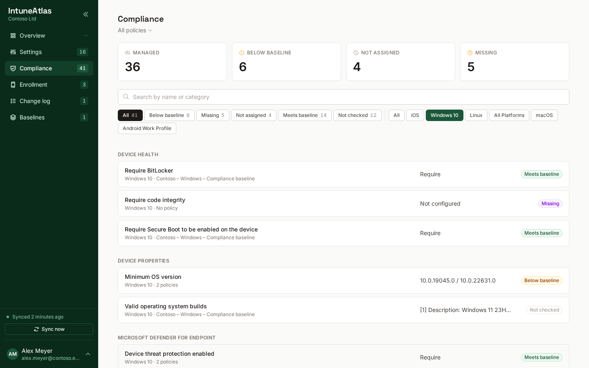

# IntuneAtlas

**[intuneatlas.com](https://intuneatlas.com)**

Flatten every Intune profile into one settings index, matched by the real
setting — not just a shared name.

The Intune portal is organised around policies. Devices apply a merged set of
settings. IntuneAtlas reads a tenant read-only, rebuilds that merge, and
serves it as something you can actually search: every setting once, grouped
by category, with each policy that sets it and its value — and with
conflicts, coverage gaps and baseline drift surfaced instead of buried in
per-policy views. Configuration policies and compliance policies both, for
the whole tenant or for one group.

<p>
  
  
</p>
<p>
  
  
</p>

**Status: early, but real.** Scanning, baselines, per-group views and a
review-gated change log are real; writing a staged change back to the tenant
isn't — see the roadmap below. Backed by a real test suite, not just
typechecking — see [`test/`](./test).

## Getting started

```
irm https://intuneatlas.com/install.ps1 | iex          # Windows
curl -fsSL https://intuneatlas.com/install.sh | bash    # Linux
```
```
intuneatlas ui --tenant <your-tenant>.onmicrosoft.com
```

That's it for a solo run. The **[Getting started guide](https://intuneatlas.com/docs/)**
covers the one-time Entra app registration the first sign-in needs, sharing
it with a team and assigning roles, and has the full
[CLI reference](https://intuneatlas.com/docs/cli.html). Building from a
clone instead: `npm install && npm run build && node dist/cli.js ui`.

To host a shared instance on Azure instead of a machine of your own, see
[`infra/azure`](./infra/azure) — one template, deployed from a button, onto
Azure Container Apps.

## What's in this repo

| Path | What it is |
|---|---|
| [`index.html`](./index.html) | Static marketing/landing page for the project |
| [`docs/`](./docs) | The getting started guide and CLI reference served at intuneatlas.com/docs |
| [`src/`](./src) | The CLI — auth, Graph scanning, settings index, local server |
| [`web/`](./web) | The local web UI (Vite + React), served by `intuneatlas ui` |
| [`test/`](./test) | Fixture-driven regression tests for the merge/conflict/baseline logic and the auth/authorization layer |
| [`Dockerfile`](./Dockerfile), [`infra/azure/`](./infra/azure) | The app as a container image, and a template that deploys it to Azure Container Apps |
| [`baselines/`](./baselines) | How a baseline folder is laid out — no baselines ship with the app |
| [`scripts/seed-tenant/`](./scripts/seed-tenant) | Dev-only tooling that seeds a dedicated test tenant — see [`TESTING.md`](./TESTING.md) |
| [`_headers`](./_headers) | Cloudflare Pages response headers (CSP, etc.) for the landing page |

## The idea

Every setting is in exactly one of six states:

- **Conflict** — two policies set the same setting to different values and
  can reach the same group. Different values for different groups, such as
  update rings, are not a conflict.
- **Below baseline** — the setting falls short of a baseline you've loaded:
  the Open Intune Baseline, a CIS export, or your own gold-standard policies.
- **Missing** — a baseline expects a setting that no policy configures.
- **Not assigned** — a policy sets it but targets no group, so it silently
  affects nothing.
- **Meets baseline** / **Not checked** — passing, or not covered by any
  active baseline. These two stay out of the way.

Around that:

- **One group at a time.** Pick a group and every page shows only what
  reaches it — assigned to it, to a group containing it, or to everyone —
  with conflicts and baseline results worked out again for that group.
- **Compliance policies as settings.** What compliance policies demand is
  listed the same way, for Windows, iOS, macOS, Android and Linux, including
  the actions for noncompliance and the tenant-wide compliance settings.
- **Values as Intune has them.** A value shows, and can be edited, with the
  same options, ranges, lists and sub-settings the portal offers.
- **Staged, reviewed changes.** A changed value is staged in the policy that
  holds it or in a new policy you name, and needs a reason and a reviewer.
  Nothing is written to the tenant.
- **A history per setting.** Every scan is compared with the one before, and
  what changed — a value, a policy starting or no longer setting it, an
  assignment — is kept on the setting, whoever made the change and wherever.
- **Documented.** A note explaining a deliberate deviation is attached to the
  setting itself, so context survives the person who wrote it.

## Baselines

A baseline is a folder of **policies exported from Intune** — Settings
Catalog policies and compliance policies, the JSON exactly as exported,
nothing converted. Settings are matched to your tenant by Intune's own
setting ID, and compared value by value, sub-settings included. A baseline is
a floor: what it specifies must be there, and anything beyond it is fine.

Add one from the web UI's Baselines page (choose the downloaded folder), or
drop it into `~/.intuneatlas/baselines/<source>/<name-and-version>/` yourself.
Nothing ships with the app; anything in a baseline download that isn't one of
those two kinds of policy is skipped.

An exported policy says what a setting should be, not why. An optional
`baseline.yml` beside the policies adds that per setting, without changing the
stored values: severity, rationale, a reference, "this number or less", or
"ignore this one". See [`baselines/README.md`](./baselines/README.md).

## Trust model

This is a tool you point at your own Intune tenant, so it's worth being
explicit about what's actually verifiable, rather than asking for trust:

- **No shared trust surface.** There's no bundled client ID or shared
  service anywhere — every install registers its own Entra app and signs in
  with it. A compromise of this project's own infrastructure (there isn't
  much of it) can't compromise your tenant, because nothing of yours ever
  runs through anything shared.
- **Build provenance, not just a signature.** Every release carries a
  [Sigstore](https://www.sigstore.dev/)-signed attestation (plus an SBOM)
  tying the binary to the exact commit and workflow it came from — verify
  it yourself: `gh attestation verify <file> --repo jgeselle/intuneatlas`.
  Windows still shows a SmartScreen warning on first run either way — that's
  publisher reputation, a separate thing only a paid cert changes.
- **Read-only, and testably so.** IntuneAtlas never writes back to your
  tenant — see [`test/`](./test) for the regression suite covering the merge
  logic that decides what you see.
- **Access is enforced server-side, not just hidden in the UI.** Entra App
  Roles (Viewer / Contributor / Admin) gate every mutating action, in the
  web UI and the CLI alike — see the
  [Getting started guide](https://intuneatlas.com/docs/) for assigning them.

## Maintenance expectations

This is a solo, unpaid, MIT-licensed project — not a company, not a
product with an SLA. I maintain it because I use it, on a best-effort
basis; there's no guaranteed response time on issues or feature requests.
Found a security issue? Please see [`SECURITY.md`](./SECURITY.md) rather
than opening a public issue.

## Roadmap

- [x] Graph API read-only scan of Intune policies (Settings Catalog, compliance, enrollment)
- [x] Cross-policy setting merge + conflict/coverage detection, aware of who each policy is assigned to
- [x] Per-group view: everything narrowed to what reaches one group
- [x] Compliance policies as settings (Windows, iOS, macOS, Android, Linux), actions for noncompliance and tenant-wide compliance settings included
- [x] Values with Intune's own options, ranges, lists and sub-settings, editable in place
- [x] `intuneatlas ui` — web UI over the generated index, solo or shared with a team (`--host`), everyone signing in with their own Microsoft account
- [x] Baselines as exported Intune policies (Settings Catalog and compliance), matched by setting ID, with optional per-setting annotations — added, renamed and removed from the web UI
- [x] Review-gated change log (stage a change in an existing or a new policy, require a reason and a signed-in reviewer)
- [x] Packaging: standalone Windows binary (SEA), PowerShell installer, winget manifest template
- [x] `ui --persist` / `--stop` — a shared instance that survives reboots (Scheduled Task on Windows, systemd on Linux)
- [x] Entra App Roles (Viewer / Contributor / Admin), enforced server-side across the UI and CLI
- [x] Sigstore build provenance + SBOM attestations on every released binary — see [Trust model](#trust-model)
- [x] Per-setting history of what changed between scans
- [ ] Actually deploying a staged change back to the tenant (write-back) — deliberately deferred; the review gate above exists, the write doesn't yet
- [ ] Enrollment configurations as settings — they are listed by name and assignment only
- [ ] Legacy (template-based) device configuration profiles beyond a handful of Windows Device Restrictions settings
- [ ] `intuneatlas get <path>` headless command
- [x] Container image and an Azure Container Apps template with a "Deploy to Azure" button — see [`infra/azure`](./infra/azure)
- [ ] Scheduled scans for a hosted instance — today a signed-in Admin starts each scan
- [ ] GitHub Action for scheduled drift scanning

## License

[MIT](./LICENSE) © 2026 IntuneAtlas contributors

Not affiliated with, endorsed by, or supported by Microsoft. Intune and
Microsoft Graph are Microsoft trademarks.
